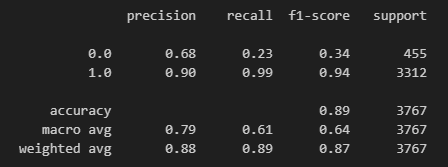

# What we've done so far

- [Day 1](/comp/day1/)
- [Day 2](/comp/day2/)

## EDA

## Preprocessing

- imputation
- normalization/standardization
- imbalance handling
- pca

## Modelling

- svm: ~90%
- neural network: ~90%
- xgboost: ~90% 

### Notes

- Bias

- Working Process

1. EDA
2. Imputasi
3. Normalisasi
4. Balancing Data
5. Cek EDA
6. Modeling
7. Cross Validasi