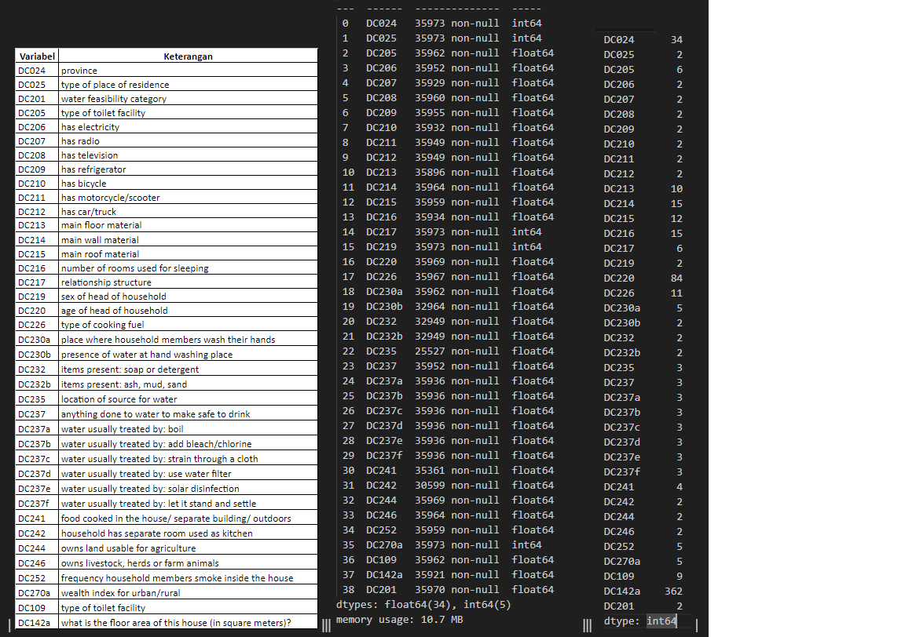

# What we've done so far

- [Day 1](/comp/day1/): quick EDA, preprocessing (imputation knn, balancing, one-hot), modelling (xgboost)
- [Day 2](/comp/day2/): proper imputation of categorical data with mice forest, feature importance
- [Day 3](/comp/day3/): deep dive into data, implement lightgbm, xgboost custom threshold
- [Day 4](/comp/day4/): implement proper one hot encoding with library category_encoders, xgboost
- [Day 5](/comp/day5/): try catboost
- [Day 6](/comp/day6/): try dropping outliers, imputation mice forest with 10 iteration (best between 3, 5, 13), lightgbm
- [Day 7](/comp/day7/): check data

Best F1 Score: 0.97972 : One Hot Encode, no smote, minmax, lightgbm
excalidraw archive: [file](gammafest.excalidraw)
google sheet archive: [metadata](https://docs.google.com/spreadsheets/d/1vWXQrRzFhNiwGbiuG8T5AQgqjREpp0Py/edit?usp=sharing&ouid=110574323835189930517&rtpof=true&sd=true)

## EDA

- 
- Viewing outliers

## Preprocessing

- imputation mice forest, mice, knn
- categorical nan values filled with mode
- normalization/standardization
- imbalance handling smote, smoteTomek, smoteENN
- feature importance
- pca

## Modelling

the result was from the train set, see [excalidraw](gammafest.excalidraw) for the submission results

- svm: ~90%
- neural network: ~95%
- xgboost: ~95%
- lightgbm: ~95%

### Notes

- Working Process

1. EDA
2. Impute
3. Balancing Data
4. Check EDA
5. Normalize
6. Modeling
7. Hypertuning
8. Evaluate based on the chosen metric
9. Cross validate
